<p align="left" style="display: flex; align-items: center;">
  
  
</p>
      


<br>


   
## 📌 프로젝트 개요

   <p align="center">
        
      </p>
  <p align="center">
        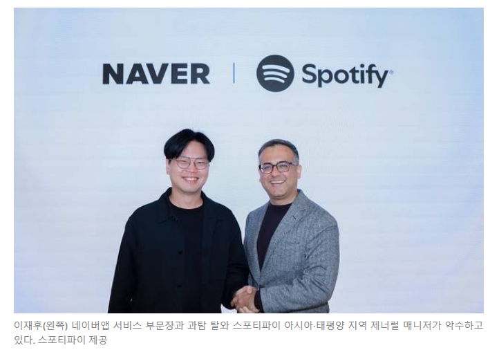
      </p>

<br>

국내 음악 스트리밍 시장에서 경쟁이 심화되면서, **고객 이탈(Churn)** 은 플랫폼의 수익성과 직결되는 핵심 문제가 되었습니다.
특히 Spotify는 최근 ‘Spotify Free’ 를 **한국 시장에 론칭하며 점유율 확대**를 적극적으로 추진하고 있어,
**잠재적 이탈 고객을 조기에 식별하고 유지 전략을 세우는 능력이 더욱 중요**해지고 있습니다.

<br>

 <p align="center">
        
      </p>
<p align="center">
  
  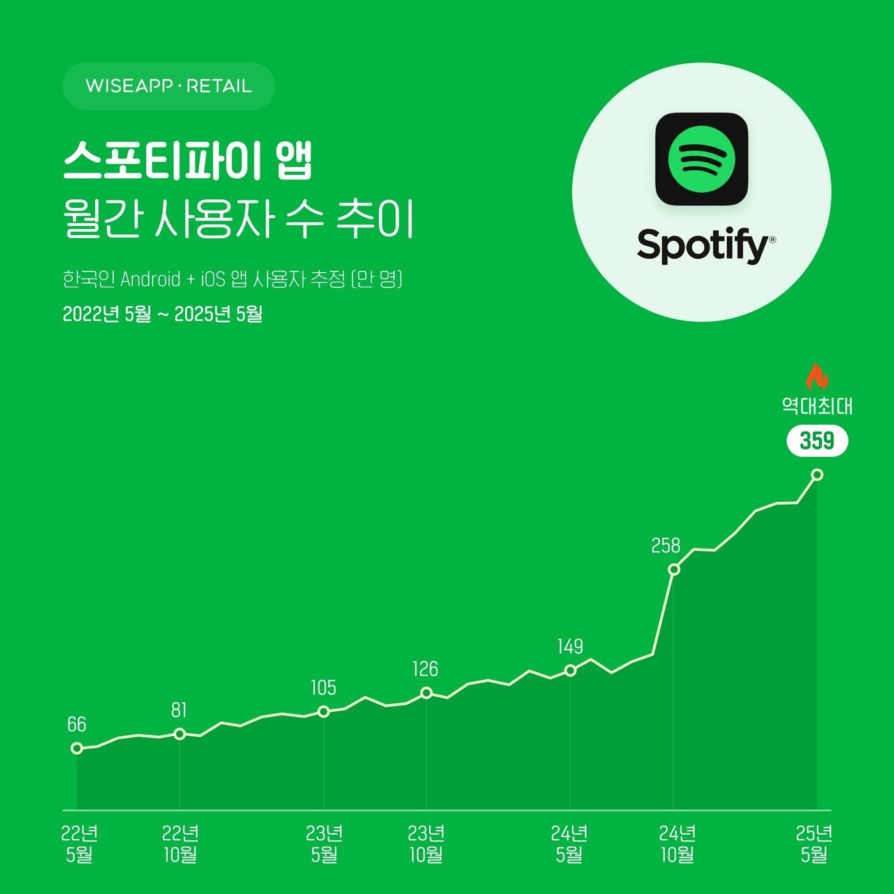
  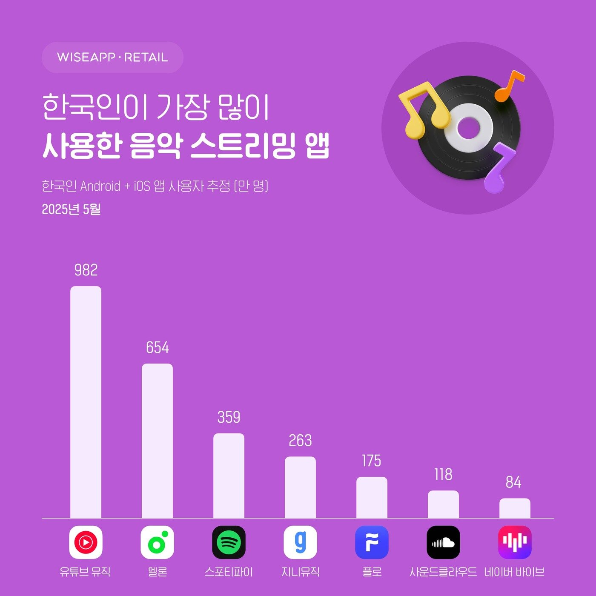
</p>

</div>

<br>

본 프로젝트는 Spotify 사용자 데이터를 기반으로,
사용자 행동 데이터를 분석하여 **이탈 가능성**을 예측하는 웹 어플리케이션을 개발하는 것을 목표로 합니다.
이를 통해 **마케팅/운영 팀은 다음과 같은 의사결정**을 **효과적**으로 수행할 수 있습니다.
<br>

- **🎧 사용자에게 개인화된 도전과제와 칭호 시스템 제공**

- **📊 사용자 행동 기반 이탈 위험도 분석 및 시각화 대시보드 제공**

- **👩‍💻 관리자가 유저·도전과제를 전체적으로 다룰 수 있는 관리 시스템 구현**

- **🔍 머신러닝 기반 Churn 위험 고객 자동 탐지 및 리텐션 전략 적용**


<br>

본 시스템은 단순 예측을 넘어서,
파생 변수 기반의 **행동 인사이트 분석**과
**시각화 기능**을 제공하여,
**Spotify 내부 팀이 보다 직관적으로 데이터 기반 결정을 내릴 수 있도록 지원**합니다.

<br><br><br>

<h2>👥 팀 구성 및 역할 분담</h2>
<p><strong>Team 역전파</strong></p>
      
<table>
<tr>

<!-- 박수빈 -->
<td align="center" width="200" style="vertical-align: top; padding: 15px;">
  
  <h3 style="margin: 10px 0 5px 0;">박수빈</h3>
  <p style="margin: 5px 0;">총괄 | Streamlit + Integrator</p>
  <a href="https://github.com/sbpark2930-ui">
    
  </a>
</td>

<!-- 신지용 -->
<td align="center" width="200" style="vertical-align: top; padding: 15px;">
  
  <h3 style="margin: 10px 0 5px 0;">신지용</h3>
  <p style="margin: 5px 0;">백앤드 + 전처리 검증 + Feature튜닝 + 모델링</p>
  <a href="https://github.com/sjy361872">
    
  </a>
</td>

<!-- 윤경은 -->
<td align="center" width="200" style="vertical-align: top; padding: 15px;">
  
  <h3 style="margin: 10px 0 5px 0;">윤경은</h3>
  <p style="margin: 5px 0;">데이터분석 + 파이프라인 설계</p>
  <a href="https://github.com/ykgstar37-lab">
    
  </a>
</td>

<!-- 정세연 -->
<td align="center" width="200" style="vertical-align: top; padding: 15px;">
  
  <h3 style="margin: 10px 0 5px 0;">정세연</h3>
  <p style="margin: 5px 0;">모델 템플릿제작 + Baseline 학습</p>
  <a href="https://github.com/wjdtpdus25">
    
  </a>
</td>

<!-- 박민정 -->
<td align="center" width="200" style="vertical-align: top; padding: 15px;">
  
  <h3 style="margin: 10px 0 5px 0;">박민정</h3>
  <p style="margin: 5px 0;">Pipeline 구현 담당</p>
  <a href="https://github.com/silentkit12">
    
  </a>
</td>

</tr>
</table>

<br><br>

<h2>👤❓ WBS</h2>
<p align="center">
        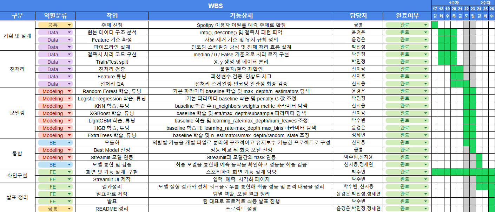
      </p>

</div>


<br><br>

## 🛠 Tech Stack

### 🎛 Backend (API 서버)


<br>

### 📊 Data Processing & Analysis


<br>

### 📈 Data Visualization


<br>

### 💾 Model Saving / Utility


<br>

### 🖥️ Frontend (Streamlit)


<br>

### ⚙️ Dev Environment


</div>
<br><br><br>


<div> 


## 📁 실제 폴더 구조
</div>

```plaintext
SKN21-2nd-2Team/
├── backend/                             # Flask API + ML 백엔드
│   ├── app.py                           # 전체 API (유저/로그/예측/CSV/Spotify 등)
│   ├── inference.py                     # 전처리 pkl + 최종 HGB 모델 pkl 기반 전체 피처 이탈 예측
│   ├── inference_sim_6feat_lgbm.py      # 6피처 LGBM(단조 제약) 시뮬레이터 추론
│   ├── preprocessing_pipeline.py        # 전처리 파이프라인 정의 및 pkl 저장/로드 유틸
│   ├── models.py                        # get_model() 팩토리 + MODEL_REGISTRY
│   ├── config.py                        # 공통 설정 (DATA_PATH, THRESH 범위, MODEL_PKL_PATH 등)
│   ├── training/                        # 학습/실험 스크립트 (train_experiments.py 등)
│   └── tests/                           # 시나리오 기반 API·모델 동작 점검
│
├── frontend/                            # Streamlit UI + Spotify 연동
│   ├── run_app.py                       # 메인 UI 실행 진입점
│   ├── main.py                          # 백엔드 API 연동 Streamlit 화면
│   └── utils/                           # Spotify 인증, API 래퍼, 상태 관리
│
├── data/                                # 원본/가공 데이터 및 전처리 결과
│   ├── raw/                             # 원본 CSV
│   ├── processed/                       # 전처리·합성 결과(pkl, enhanced_*.csv)
│   └── user_data.csv                    # DB 적재용 유저 CSV
│
├── models/                              # 학습된 모델 및 메트릭
│   ├── model_lk.pkl                     # 최종 선정된 HGB 모델 (inference.py 에서 사용)
│   ├── hgb_sim_6feat.pkl                # 6피처 시뮬레이터용 HGB 모델
│   ├── lgbm_sim_6feat_mono*.pkl         # 6피처 LGBM(단조 제약) 모델들
│   └── metrics.json                     # 실험 결과 누적 메트릭
│
├── docs/                                # 실험 기록, 설계/성능 정리 문서
├── notebooks/                           # EDA, 전처리·FE·모델링 노트북
├── utils/                               # DB 연결, 유저 CSV 로드 등 공용 유틸
├── image/                               # README/발표용 이미지
├── pipeline_test.py                     # 파이프라인 동작 테스트 스크립트
├── requirements.txt
└── README.md
```
<br>
<div> 

<br>

---

<br>


## 1)  Data & Baseline Setup

  - **데이터 구조**: 8,000명 유저, 유저당 1행 스냅샷 (수치형 6개 + 범주형 4개, 타깃 `is_churned`)
       ### 🔹 `Original Dataset` — 원본 피처 테이블
      | 컬럼명                   | 타입        | 설명               | 
      | --------------------- | --------- | ---------------- |
      | `user_id`              | INT       | 사용자 고유 ID        | 
      | `gender`                | VARCHAR   | 성별 (Male/Female) | 
      | `age`                   | INT       | 사용자 나이           | 
      | `country`               | VARCHAR   | 접속 국가            | 
      | `subscription_type`     | VARCHAR   | 요금제 종류           |
      | `listening_time`        | FLOAT     | 하루 음악 청취 시간(분)   | 
      | `songs_played_per_day`  | FLOAT     | 하루 재생 곡수         |
      | `skip_rate`             | FLOAT     | 스킵률              |
      | `device_type`           | VARCHAR   | 기기 종류            |
      | `ads_listened_per_week` | INT       | 주간 광고 시청 수       |
      | `offline_listening`     | INT (0/1) | 오프라인 재생 기능 여부    |
      | **`is_churned`**            | INT(0/1)  | 이탈 여부            |


#### 🔗 출처 [Spotify Analysis Dataset](https://www.kaggle.com/datasets/nabihazahid/spotify-dataset-for-churn-analysis?resource=download)
<br>

- **초기 베이스라인** (`preprocessing_validation.ipynb`, `FE_validation.ipynb`):
  - 수치형 6개 + 핵심 FE 5개(engagement_score, songs_per_minute, skip_intensity, skip_rate_cap, ads_pressure) 조합(Set D)
  ### 🔹`Feature Engineering` — 파생 변수 테이블
  | 컬럼명                | 타입      | 설명                                |
  | --------------------- | --------- | ------------------------------------ |
  | `engagement_score`   | FLOAT   | listening_time × songs_played_per_day             |
  | `songs_per_minute` | FLOAT | songs_played_per_day / listening_time               |
  | `skip_intensity`     | FLOAT   | skip_rate × songs_played_per_day  |
  | `skip_rate_cap`         | FLOAT   | skip_rate.clip(0, 1.5) |
  | `ads_pressure`         | FLOAT   | ads_listened_per_week / listening_time |

<br>

  - **모델**: RandomForestClassifier(class_weight='balanced') + threshold 튜닝
  - **성능**: **F1≈0.41, AUC≈0.54** 수준에서 정체

  ### 🔹`Correlation Baseline` -– 초기 상관관계 분석
  <p align="center">
        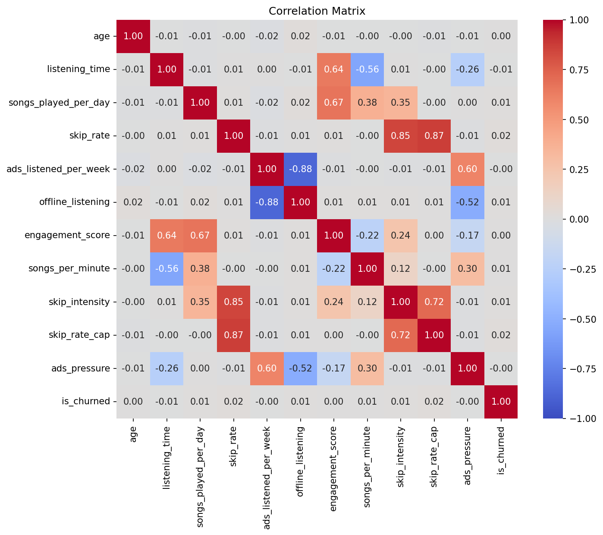
      </p>

   - 초기에는 피처 간 상관성이 높지 않음을 확인
   - 단일 피처만으로는 churn 예측이 어려움
   - 특히 skip 계열 변수들이 서로 강한 상관성을 가짐
   - **engagement_score 관련 피처**는 churn과 직접 연관이 약함
      
<br><br>

## 2) Feature Engineering & Feature Selection 검증
- **FE 검증** (`FE_validation.ipynb`, `FE_add.ipynb`):
  - 여러 FE 세트(Set A~G) 및 추가 세그먼트/ratio/비선형 FE 후보를 실험
  - **결과**: 핵심 FE 4~5개만 남기는 것이 최선, 복잡한 교호작용·플래그를 더해도 성능 개선은 ΔF1≈0 수준
<p align="center">
        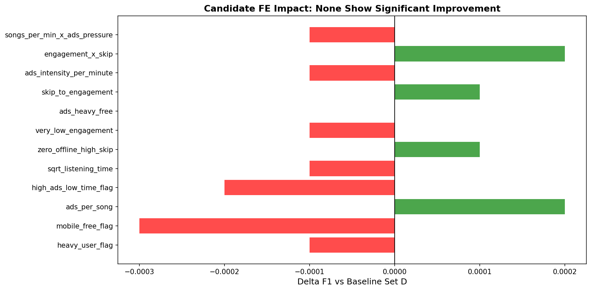
      </p>
 <br>
 
- **범주형 및 FS 검증** (`feature_selection.ipynb`):
  - `gender`, `country`, `subscription_type`, `device_type` 및 파생 범주형을 One-Hot 인코딩해 포함
  - 수치형+FE(10~11개) vs 수치형+FE+범주형(30개 이상) 비교 시 **오히려 F1/AUC 소폭 하락 → 범주형 기여도 낮음**
 <p align="center">
        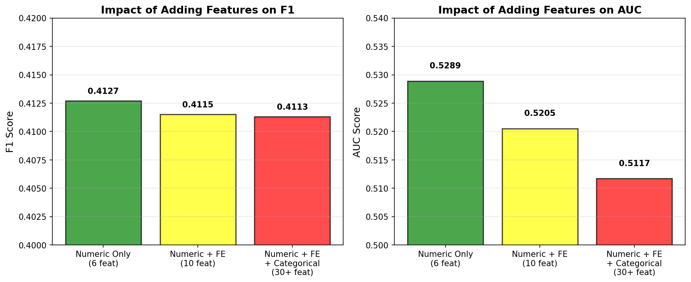
      </p>

<br><br>

## 3) Model Tuning·SMOTE·앙상블 검증
- **모델/파라미터 튜닝** (`feature_selection.ipynb`):
  - RandomForest 하이퍼파라미터(RandomizedSearchCV), K-Fold + threshold 튜닝, 소프트보팅 앙상블(RF+XGB+HGB) 등 적용
  - **결과**: 어떤 조합도 F1 0.41±0.01, AUC 0.52~0.54 범위를 크게 넘지 못함

<p align="center">
        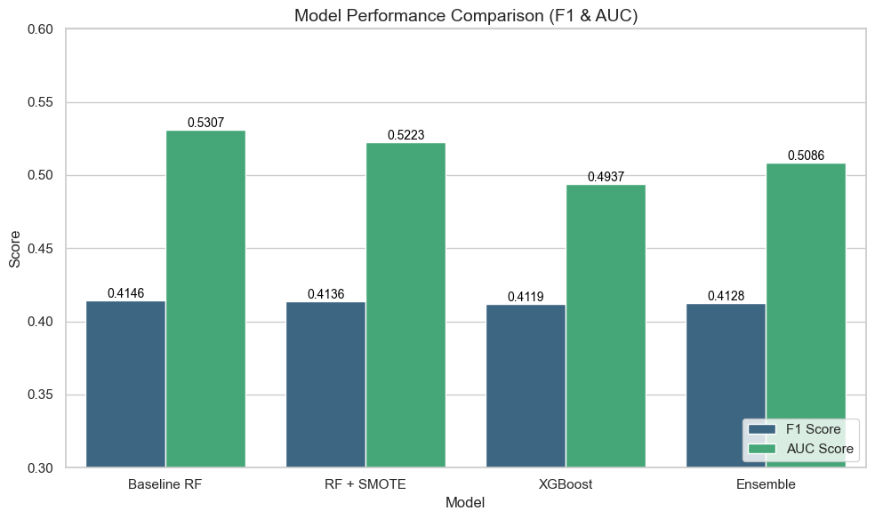
      </p>

<br>
  
- **SMOTE + XGBoost + 앙상블** (`SMOTE_XGB_RF.ipynb`):
  - SMOTE(오버샘플링 비율·test_size·scale_pos_weight 등 여러 버전), XGBoost GridSearchCV, RF+XGB+HGB 앙상블 시도
  - **결과**: Train에서는 F1↑지만 Test에서는 Baseline보다 낮거나 비슷한 수준 → **심한 과적합 & 실질적 개선 실패**
<p align="center">
        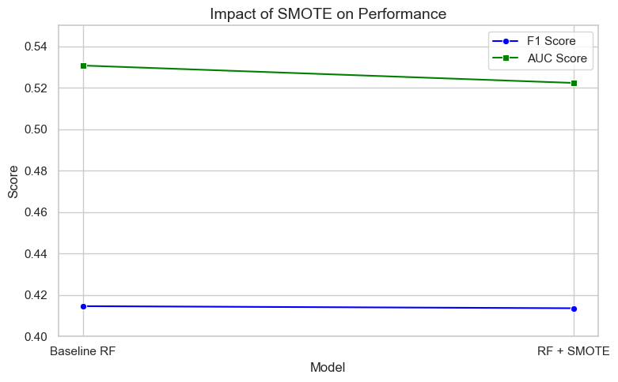
      </p>

<br><br>

## 4) Limitations & Root Cause Analysis(한계 원인 분석)
- **통계·상관·Feature Importance 분석** (`feature_selection.ipynb` 6장, `improvement_proposal.md`):
  - 모든 피처에서 t-test p-value>0.05, 상관계수 |r|<0.02 → 이탈/비이탈 간 행동 차이가 통계적으로 거의 없음
<p align="center">
  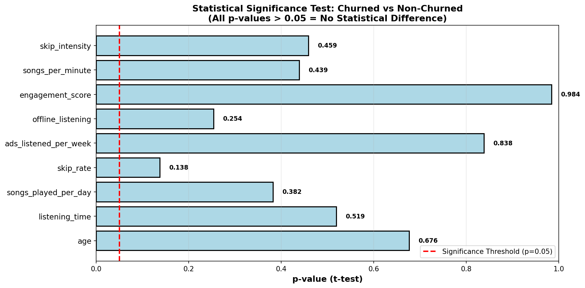
  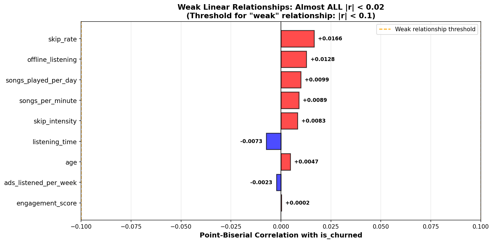
</p>

  - RF Feature Importance & Permutation Importance도 특정 피처가 두드러지지 않고 8~14% 수준으로 고르게 분산
<p align="center">
        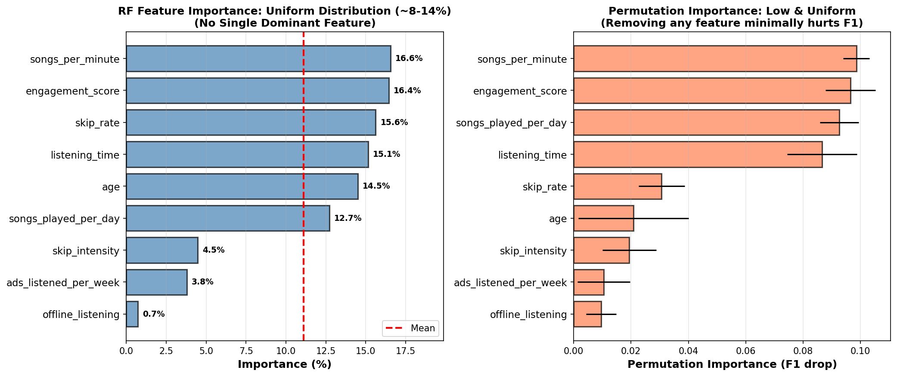
      </p>
      
<br>

- **결론**:
  - 현재 구조(유저당 1행 스냅샷 + 단일 시점 피처)에서는 **F1≈0.41, AUC≈0.53이 사실상 상한**
  <p align="center">
        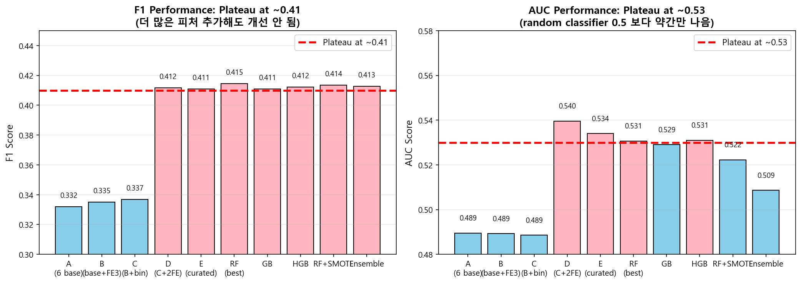
      </p>
 - 모델 변경·튜닝·SMOTE만으로는 성능을 올리기 어렵고, **데이터/피처 자체를 바꾸는 방향이 필요**함

<br><br>

## 5) 시계열·고객 접점 Features 추가 및 성능 향상
- **개선 아이디어 정리 (`improvement_proposal.md`)**:
  - `Priority 1`: 최근 7/14/30일 행동 변화를 담는 **시계열 피처 5개**
  - `Priority 2`: 고객센터 문의, 결제 실패, 프로모션 반응, 앱 크래시 등 **고객 접점 피처 4개**
     ### 🔹 `Time-Series Behavioral Trends` - 시계열features(5개)
      | 피처명 | 타입 | 설명 | 예상 기여도 |
      |--------|------|------|-------------|
      | `listening_time_trend_7d` | float | 최근 7일 청취 시간 변화율 (%) | 높음 |
      | `login_frequency_30d` | int | 최근 30일 로그인 횟수 | 높음 |
      | `days_since_last_login` | int | 마지막 로그인 후 경과 일수 | 높음 |
      | `skip_rate_increase_7d` | float | 최근 1주 vs 이전 1주 스킵률 증가율 | 중간 |
      | `freq_of_use_trend_14d` | float | 최근 2주 사용 빈도 변화율 (%) | 높음 |
     ### 🔹 `Customer Interaction Signalss` - 고객접점features(4개)
      | 피처명 | 타입 | 설명 | 예상 기여도 |
      |--------|------|------|-------------|
      | `customer_support_contact` | bool | 최근 30일 내 고객센터 문의 여부 | 중간 |
      | `payment_failure_count` | int | 결제 실패 횟수 | 높음 |
      | `promotional_email_click` | bool | 프로모션 이메일 클릭 여부 | 낮음 |
      | `app_crash_count_30d` | int | 최근 30일 앱 크래시 횟수 | 중간 |

> #### 📖 [Customer Churn Prediction in anOnline Streaming Service](https://lup.lub.lu.se/luur/download?fileOId=8971757&func=downloadFile&recordOId=8971756) 📖[A comprehensive survey on customer churn analysis studies](https://www.tandfonline.com/doi/full/10.1080/24751839.2025.2528440) <br>
> "이탈 전 로그인 감소, 이용시간 감소, 스킵률 증가, 결제문제 증가” 같은 ‘패턴 방향성’을 참고

  - 실제 로그 수집이 어려운 환경을 가정해, 위 피처들을 **현실적인 분포를 가진 합성 특성**으로 먼저 실험

<br>

- **행동 기반 합성 피처 생성방법**:
  - **1) 확률적 랜덤 분포 기반 생성**: 이탈자·비이탈자 각각에 대해 현실적인 범위 안에서 랜덤 분포로 값을 생성하되, 두 그룹의 분포가 크게 겹치도록 설계해 비현실적인 과적합을 피했습니다.
  - **2) 약한 방향성만 반영**: 활동 감소, 로그인 감소, 스킵률 증가 등 실제 이탈 패턴은 평균값의 미세한 차이 정도로만 반영해, 절대값이 아니라 **경향성(behavioral signal)** 위주로만 학습되도록 했습니다.
  - **3) 15~20% 노이즈 삽입**: 각 피처의 15~20%에는 반대 패턴/완전 랜덤 값을 섞어 규칙을 일부러 깨, 모델이 패턴을 암기하지 않고도 일반화 가능성을 확인할 수 있도록 했습니다.


- **합성 피처 생성 및 검증** (`feature_engineering_advanced.ipynb`):
  - 원본 베이스라인(수치형 6 + FE 5, 총 11개) 대비, **시계열 5개 + 고객 접점 4개**를 추가한 `enhanced_data.csv` 생성
  - RandomForest 기반 실험 결과:
    - Baseline: F1≈0.42, AUC≈0.54
    - +시계열 피처: F1≈0.49, AUC≈0.73
    - +시계열+고객접점(최종): **F1≈0.62, AUC≈0.79** (ΔF1 +0.20 이상, ΔAUC +0.25 이상)
  - 이렇게 설계한 합성 피처를 적용한 `enhanced_data.csv` 기준 RandomForest 실험에서,
    - Baseline: F1≈0.42, AUC≈0.54 →
    - 최종(시계열+고객접점): **F1≈0.62, AUC≈0.79** (ΔF1 +0.20 이상, ΔAUC +0.25 이상)까지 성능이 향상되었습니다.      
  
  <p align="center">
        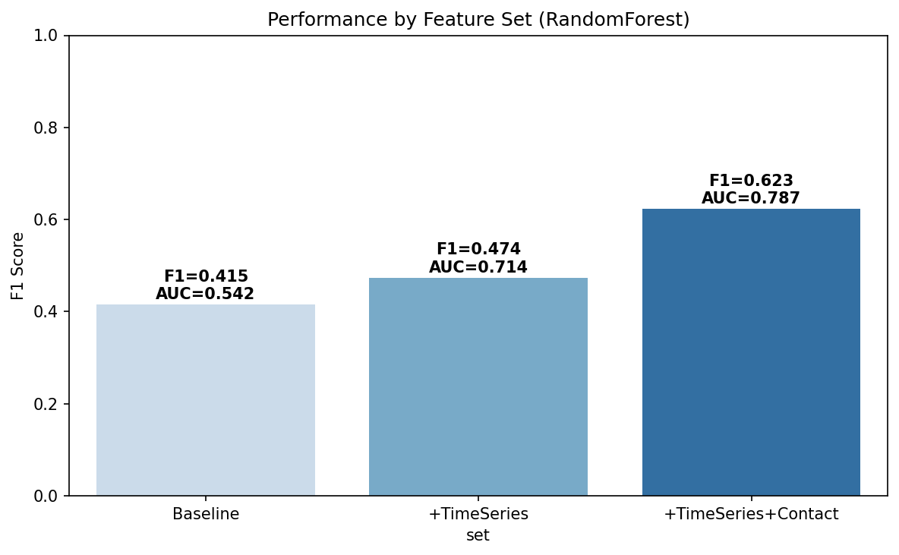
      </p>      
 - **Feature Importance 기준 핵심 기여 피처**:
    - `payment_failure_count`, `app_crash_count_30d` (고객 접점)
    - `freq_of_use_trend_14d`, `listening_time_trend_7d`, `skip_rate_increase_7d` (시계열)
  <p align="center">
        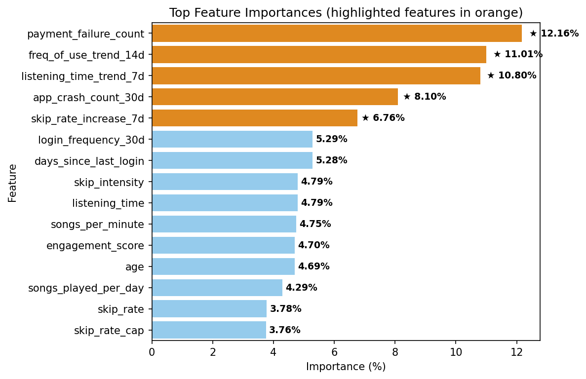
      </p>      
  
  ### 🔹`Enhanced Correlation` – 확장 피처 상관관계 분석
 <p align="center">
        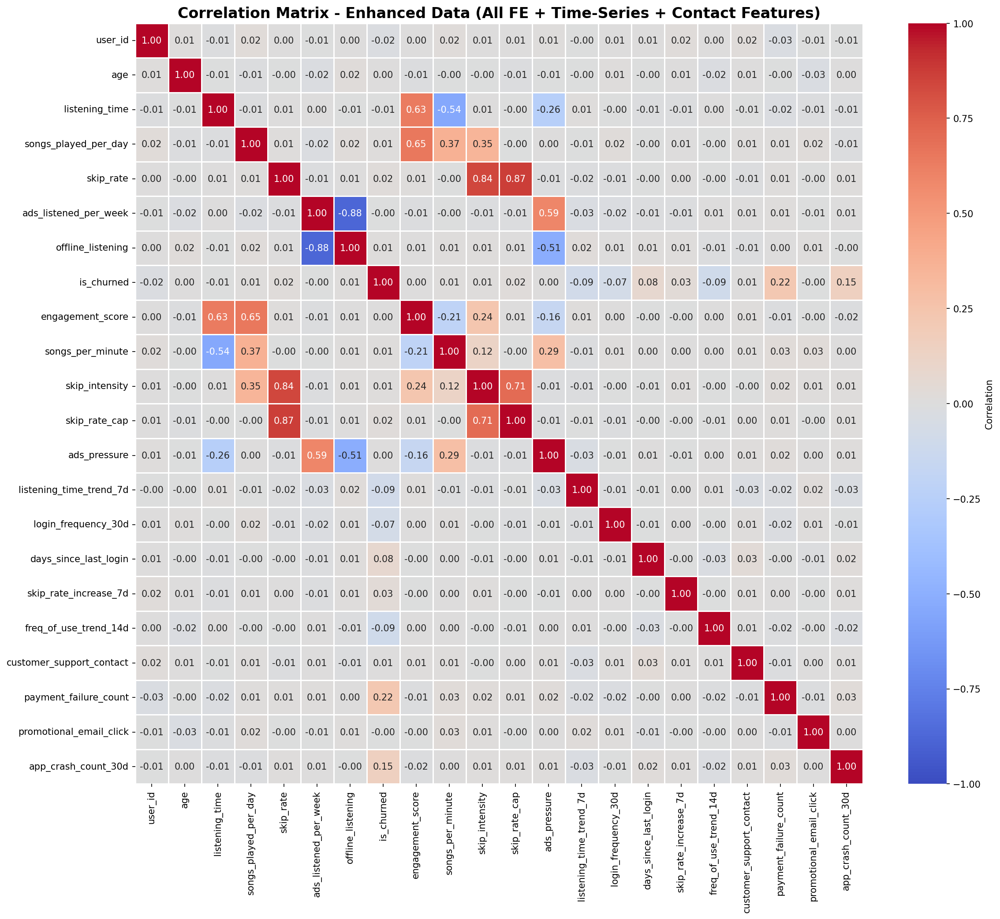
      </p>
   
   - 추가한 시계열 피처들이 churn과 **더 강한 상관성**을 보임
   - **login_frequency_30d, skip_rate_increase_7d** 등 새로운 신호 포착
   - 기존 FE보다 구조화된 **churn 신호가 증가**
   - **추가 features** 덕분에 모델 성능 향상

<br><br>

## 6) Preprocessing Pipeline Refinement
- **전처리 정책 및 데이터 버전** (`preprocessing_validation_v2.ipynb`, `reset.md`):
  - 합성 피처 포함 데이터 `enhanced_data.csv` 생성 후,
    - 결측/이상치 처리 버전: `enhanced_data_clean.csv`
    - FE 5개를 제거한 최종 모델 입력용: `enhanced_data_clean_model.csv` (원본 수치형 6 + 시계열 5 + 고객 접점 4 = **총 15개 수치형**)
  - EDA는 `enhanced_data_clean.csv`, 모델 학습은 `enhanced_data_clean_model.csv` 기준으로 사용

<br>

- **백엔드 파이프라인 및 실험 구조** (`backend/preprocessing_pipeline.py`, `backend/models.py`, `backend/train_experiments.py`):
  - sklearn `ColumnTransformer` 기반 전처리 파이프라인(결측/이상치 처리 + 수치형 스케일링 + 범주형 One-Hot)
  - `get_model()` + `MODEL_REGISTRY` 구조로 모델 생성, `MODEL_PARAMS` 딕셔너리로 하이퍼파라미터 튜닝
  - 실험 결과는 `models/metrics.json`에 누적 저장하도록 설계

<br><br>

## 7) Final Summary & Key Takeaways
- **현재 데이터(스냅샷)만 사용**했을 때는, 다양한 FE/FS/튜닝/SMOTE/XGBoost/앙상블을 모두 시도해도 **F1≈0.41, AUC≈0.53 근처에서 정체**됨.
- **시계열 + 고객 접점 피처를 추가**한 `enhanced_data.csv` 실험에서는, 동일한 모델(RF)로도 **F1≈0.62, AUC≈0.79까지 성능이 크게 상승**하는 것을 확인함.
- 이를 통해 **“모델을 바꾸는 것보다, 이탈 직전 행동 변화와 고객 접점을 담는 피처를 설계·수집하는 것이 핵심”** 이라는 결론에 도달했고,
<p align="center">
        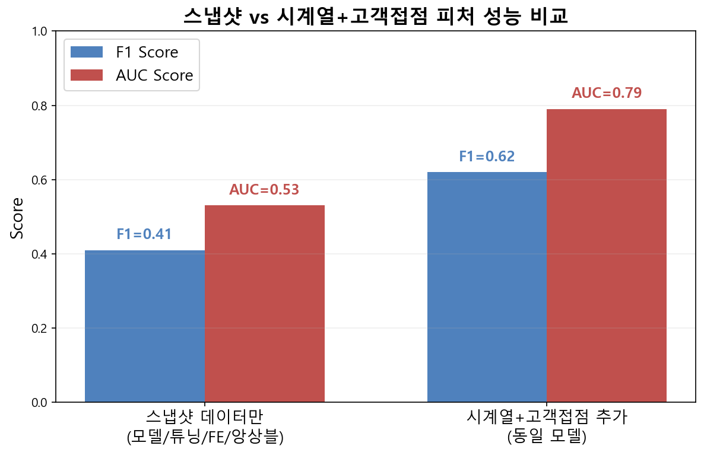
      </p> 
      
  실제 서비스 환경에서는 로그·고객센터·결제/에러 데이터를 결합한 피처 설계를 가장 우선순위로 두어야 한다는 인사이트를 얻음.

<br><br>

## 8) Final Model Comparison & Selection (HGB Selected)
- **실험 공통 조건**
  - 데이터: `data/enhanced_data_not_clean_FE_delete.csv` (원본 수치형 6 + 시계열 5 + 고객 접점 4 = **15개 수치형** 중심)
  - 전처리: `backend/preprocessing_pipeline.py` / `jy_model_test/preprocessing_pipeline.py` 의 `preprocess_and_split()`
  - 설정: `TEST_SIZE=0.2`, `RANDOM_STATE=42`, threshold 스캔(대부분 0.05-0.35/0.45, HGB는 0.05-0.45, step=0.005)

      ### 📊 Model Performance Comparison
      #### 🔸 F1 Score (정밀도·재현율 조화 평균)
      <p align="center">
        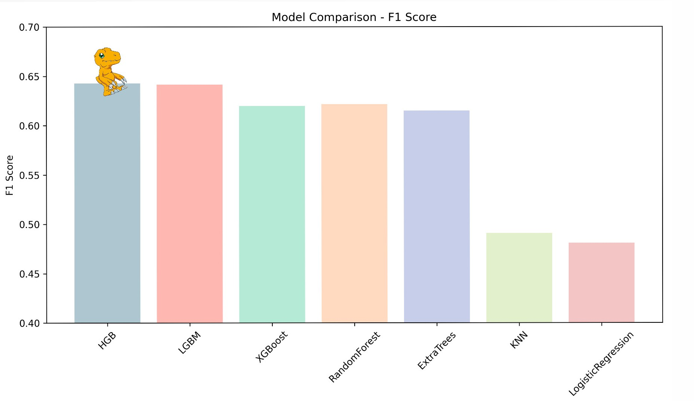
      </p>
      
      #### 🔸 ROC-AUC (분류기 구분능력 지표) 
      <p align="center">
        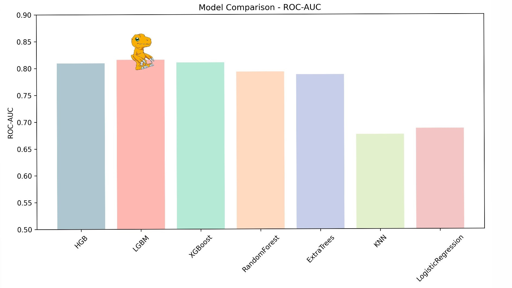
      </p>
      
      #### 🔸 PR-AUC (양성 클래스 예측 성능 지표) 
      <p align="center">
        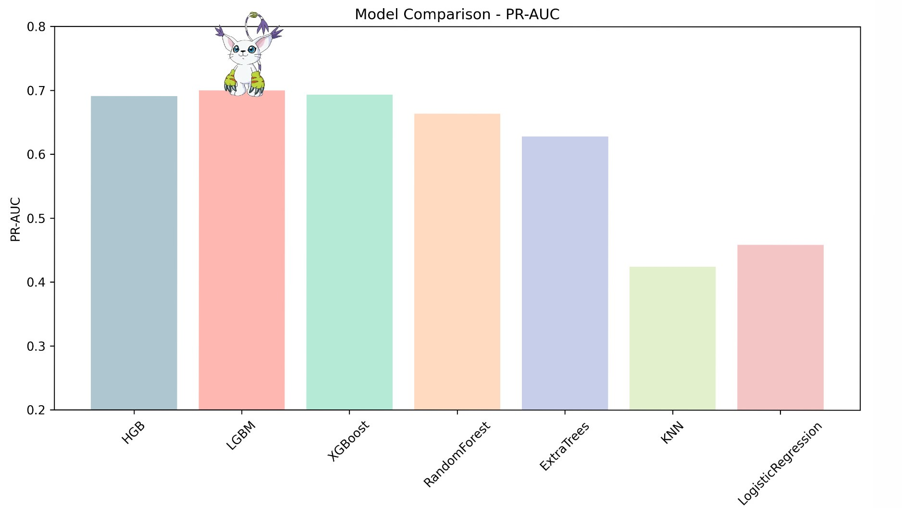
      </p>
      
      #### 🔸 Recall (이탈자 탐지 성능)  
      <p align="center">
        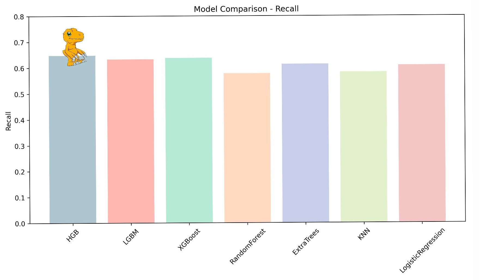
      </p>


  ### 🔹모델별 `best-run` 성능 요약
    
     | Model                   | F1 Score    | ROC-AUC    | PR-AUC     | Best Threshold | Precision | Recall |
     | ----------------------- | ----------- | ---------- | ---------- | -------------- | --------- | ------ |
     | **HGB (Best)**          | **0.6427**  | 0.8093     | 0.6910     | 0.26           | 0.6381    | **0.6473** |
     | **LGBM**                | **0.6414**  | **0.8158** | 0.6996     | 0.28           | 0.6501    | 0.6329 |
     | **XGBoost**             | 0.6197      | 0.8105     | **0.6933** | 0.44           | 0.6027    | 0.6377 |
     | **RandomForest**        | 0.6216      | 0.7932     | 0.6635     | 0.365          | 0.6732    | 0.5773 |
     | **ExtraTrees**          | 0.6150      | 0.7881     | 0.6279     | 0.34           | 0.6165    | 0.6135 |
     | **KNN**                 | 0.4908      | 0.6764     | 0.4244     | 0.26           | 0.4243    | 0.5821 |
     | **Logistic Regression** | 0.4809      | 0.6874     | 0.4587     | 0.26           | 0.3974    | 0.6086 |

<br> 

## 💡 모델 선택 근거 및 최종 결정 (Why HGB?)
### (1) F1 기준 — 팀 내 최고 성능
- HGB F1 ≈ **0.643**
- LGBM ≈ 0.641
- XGB ≈ 0.620
- RF ≈ 0.622

<br> 

➡️ 전체 모델 중 가장 높은 F1 스코어

### (2) Precision · Recall 균형성 (`hgb_test.md` 기준)
- HGB → Precision 0.638, Recall 0.647 → 균형형 모델
- XGB → Precision 낮음(0.603), Recall 높음(0.638)
- LGBM → Precision 높음(0.650), Recall 낮음(0.633)

<br> 

➡️ HGB는 FP/FN이 과도하게 증가하지 않는 안정적인 구조 <br>
➡️ 서비스 운영에 적합한 "균형적 예측력" 제공

### (3) AUC / PR-AUC 종합 비교
- LGBM → AUC 0.816 / PR-AUC 0.700 (절대 수치 가장 높음)
- XGB → AUC 0.811 / PR-AUC 0.693
- HGB → AUC 0.809 / PR-AUC 0.691 (상위권, 큰 차이 없음)

<br> 

➡️ AUC도 충분히 상위권 + F1까지 고려하면 종합 점수 최상

<br>

## 모델 성능·최종 선택 요약
> 스냅샷 + FE만으로는 **F1=0.41, AUC=0.53**에서 한계가 있었으나
> “시계열 + 고객 접점 피처” 추가 후 **F1=0.62+, AUC=0.79+** 로 큰 성능 향상이 이뤄졌고,
> 마지막으로 튜닝과 구조 정교화를 거쳐 **F1=0.63+, AUC=0.81+** 까지 개선되었다.
> **최종적으로 풀 모델(HGB)은 메인 서비스 모델**로,
> **6피처 단조제약 LGBM은 관리자의 시뮬레이터/해석용으로 분리**하여 완성도를 높였다.

<br>

## 최종 성능 단계별 요약
| 단계                      | F1 Score  | AUC       | 설명                               |
| ----------------------- | --------- | --------- | -------------------------------- |
| **① 초기 스냅샷 모델**         | 0.33      | 0.49      | 원본 데이터 그대로, 신호 거의 없음             |
| **② FE 추가(핵심 지표 생성)**   | 0.41      | 0.53      | 기본 요약지표(ex. skip_intensity 등) 추가 |
| **③ 시계열 + 고객 접점 추가 RF** | 0.62+     | 0.79+     | 행동 변화량 및 접점 신호가 성능 크게 개선         |
| **④ 최종 모델(HGB 튜닝)**     | **0.63+** | **0.81+** | 안정적·균형형 최적 모델                    |


<br><br>

---

<br>

# 🎧 Streamlit 구현 기능 (Streamlit Application Features)

## 👩‍💻 관리자
본 프로젝트는 사용자 서비스뿐 아니라,
관리자를 위한 **운영·유지보수 페이지(Admin Dashboard)** 를 포함하고 있습니다.
관리자는 Streamlit 기반의 관리자 페이지를 통해
사용자 정보, 예측 결과, 도전과제, 위험 고객 등을 통합적으로 관리할 수 있습니다.

## 🙋‍♂️ 사용자
사용자 페이지는 Spotify 사용자들이 직접
음악을 검색하고 재생하며,
**도전과제를 수행**하고,
개인 정보를 관리할 수 있는 인터랙티브 서비스 페이지입니다.
<br><br>
<br>

아래는 각 화면별로 제공되는 주요 기능입니다.

<br>

## 👩‍💻 관리자 / 🙋‍♂️ 사용자

### 🔐 로그인 페이지
#### 관리자와 사용자 계정 구분
<div style="display: flex; justify-content: center; gap: 20px;">
  
  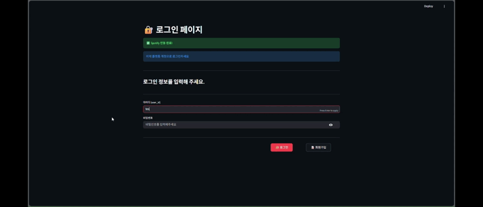
</div>
<br>

### 🏠 HOME
#### 각각 화면이 다르게 구현
<div style="display: flex; justify-content: center; gap: 20px;">
  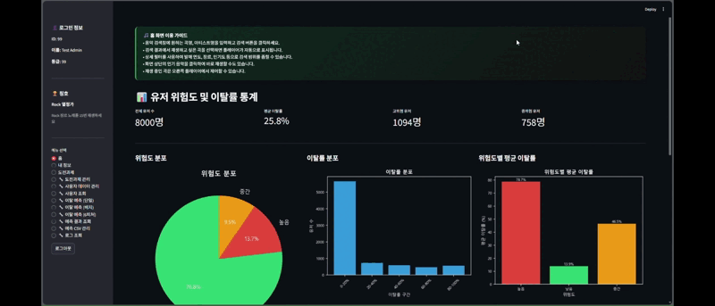
  
</div>

> #### 관리자
> - **운영 데이터 모니터링** - 이탈률·위험도·전체 사용자 통계 확인
>
<br>

> #### 사용자 
> - **음악 검색/재생** - Spotify API 기반 음악 검색 및 스트리밍
> - **상세 검색** - 발매 연도, 장르 인기도 등으로 검색 범위를 좁힐 수 있음
> - **실시간 플레이어**
> - **추천 음악**

<br><br>


## 🙋‍♂️ 사용자

### 📁 내 정보
<p align="center">
        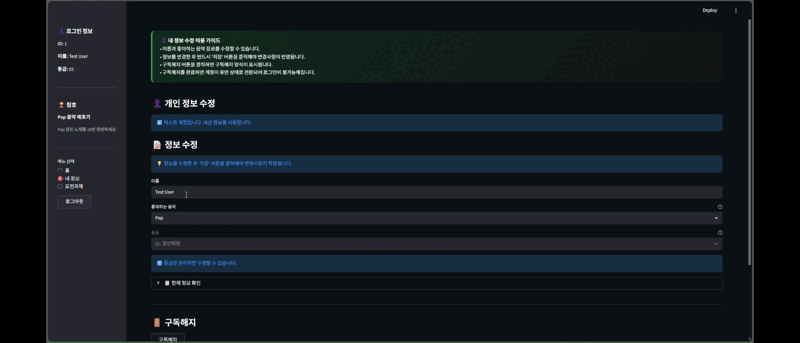
      </p>
<p align="center">
        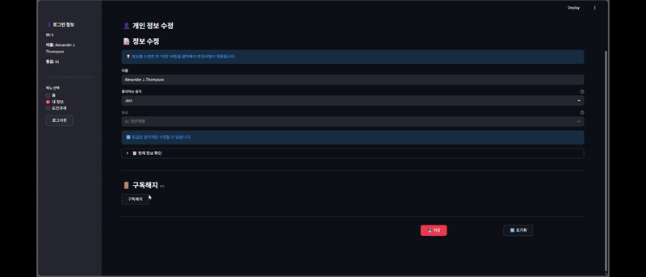
      </p>
      
> **이름** 과 **좋아하는 장르** 수정 가능 <br>
> **`구독해지`** 버튼 - 클릭 시 구독 해지 양식 표시
<br>

### 🏆 도전 과제
<p align="center">
        
      </p>
      
> 완료된 도전과제와 진행 중인 도전과제 나열로 **진행도**와 **🎵 목표 장르**, **보상**(포인트지급) 등을 표시

<br><br>


## 👩‍💻 관리자


### 🏆 도전과제 관리·생성
<p align="center">
        
      </p>

> 새로운 도전과제를 만들거나 기존 도전과제를 삭제 - 목표 재생 횟수와 보상 포인트 설정 <br>
> **도전과제 통계를 통해 사용자들의 참여 현황 확인 가능**

<br>

### 👥 사용자 데이터 관리 
<p align="center">
        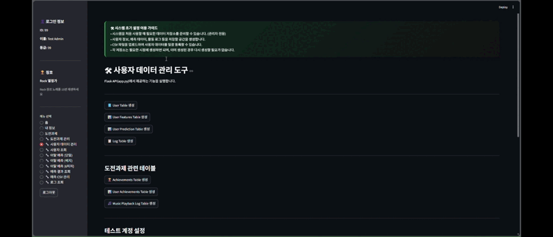
      </p>
      
> 시스템 사용시 필요한 저장소 준비 <br>
> 사용자 정보, 예측 데이터, 활동 로그 등 저장할 공간 생성
    
<br>

### 👤 사용자 조회
<p align="center">
        
      </p>

> **`사용자 조회`** - 이름, 사용자 ID, 좋아하는 음악, 등급으로 사용자 검색 <br>
> 각 사용자의 등급 변경 가능 <br>
> 각 사용자의 이탈 위험도를 확인 -> 위험 사용자 파악

<br>

### 🎯 이탈 예측(단일)
<p align="center">
        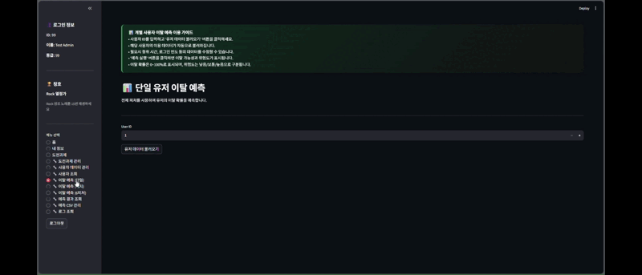
      </p>

> **`예측 실행`** 버튼 - 이탈 가능성과 위험도가 표시 <br>
> 이탈 확률은 0-100%로 표시되며, 위험도는 낮음/보통/높음으로 구분

<br>
      
### 📊 이탈 예측(배치)
<p align="center">
        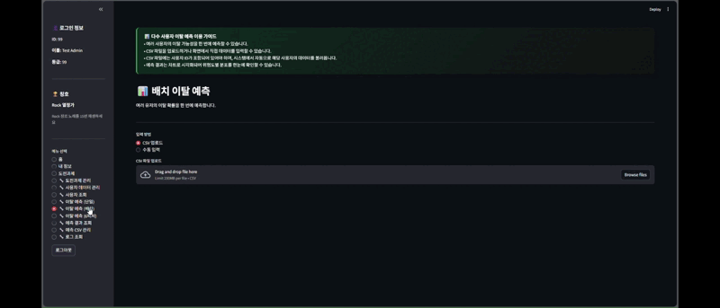
      </p>
      
> csv 파일을 업로드하거나 화면에서 수동으로 입력 가능 <br>
> 예측 결과는 차트로 시각화되어 위험도별 분포를 확인 가능

<br>

### 🧠 이탈 예측(6피처)
<p align="center">
        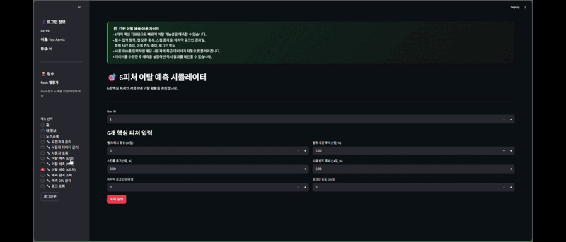
      </p>

> **6가지 핵심 지표**로 빠르게 이탈 가능성을 예측 <br>
> `앱 오류 횟수` `스킵 증가율` `마지막 로그인 경과일` `청취시간 추이` `이용 빈도 추이` `로그인 빈도`

<br>

### 🔍 예측 결과 조회
<p align="center">
        
      </p>

> 이전에 실행한 모든 이탈 예측 결과를 조회 <br>
> 위험도(낮음/보통/높음)로 필터링 --> 위험 사용자만 확인 가능 <br>
> 각 사용자의 **이탈 확률**과 **위험도** 한눈에 비교 가능

<br>

### 💾 예측 csv 관리
<p align="center">
        
      </p>

> csv 파일을 업로드하여 많은 사용자의 이탈 예측을 수행 <br>
> **`download`** - 다운로드한 파일에 사용자별 이탈 확률과 위험도가 포함

<br>

### 📖 로그 조회
<p align="center">
        
      </p>

> **사용자**들의 로그인, 페이지 접근, 구독 해지 등의 활동 내역 확인 가능 <br>
> `사용자ID` 입력 -> 해당 사용자의 활동 조회 가능 <br>
> **필터링**(로그인, 페이지조회, 구독해지) 기능 -- 모든 로그는 시간순으로 정렬(**최신순**)
      
<br><br><br>

## 📝 팀원 소감 (Team Retrospective)
<br>

| 🧑‍💼 이름 | 🛠 역할 | 💬 소감 |
|-----------|-----------|-----------|
| **박수빈** | Frontend / PM / Integrator | 주제 선정에 있어, 괜찮은 주제라고 선정했으나, DataSet 에 대한 이해도가 부족해, 결국 Data를 합성 하여 사용하게 된게 상당히 아쉽습니다. 좀 더 세심하게 업무 리딩을 했다면 이러한 사항이 없었을거 같은 데, 그럼에도 다들 맡은 바를 열심히 해주셔서 무사히 마무리 된거같습니다. |
| **신지용** | Feature Engineer / QA | 작업을 하면서 느낀 건, 모델 성능을 끌어올리는 것도 중요하지만 **“데이터가 어떤 이야기를 하고 있는지 이해하고, 그 데이터를 믿고 다시 쓸 수 있게 만드는 구조”**가 훨씬 더 큰 기반이 된다는 사실이었습니다.

처음엔 같은 베이스라인 데이터에서 모델과 파라미터만 계속 바꿔봤는데, 기대만큼 변화가 없었습니다. 하지만 사용자 행동 로그, 시계열 흐름, 고객 접점 피처를 직접 설계하고, 합성 데이터를 통해 먼저 방향성을 검증하기 시작하면서, 무엇이 의미 있는 피처인지, 모델이 어디까지 해낼 수 있는지가 훨씬 또렷하게 보였습니다. 그 순간부터 실험은 숫자가 아니라 근거와 맥락을 갖기 시작했습니다.

또한 preprocessing_pipeline.py → train_experiments.py → inference.py → app.py 로 흐름을 정리하며, 팀원 누구나 이해하고 다시 학습하고 그대로 API에 붙여 쓸 수 있는 형태로 만드는 데 집중했습니다. 한 번 돌려본 코드가 아니라, 재현되고 확장되는 코드가 되도록 묶어둔 이 구조는 개인적으로도 큰 성취였고, 그 점에서는 스스로 꽤 만족하고 있습니다.

물론 한편으로 아쉬움도 남습니다. 이번에는 실제 운영 로그가 아닌 합성 피처 기반으로 실험을 진행했기에, 이탈(churn) 패턴의 방향성은 확인했지만, 실제 운영 환경에서의 성능과 안정성 검증은 아직 더 필요합니다. 그래서 앞으로는 이번에 설계한 피처들과 데이터 스키마를 실제 로그 형태에 최대한 맞춰 정렬하고, 운영 데이터 기준으로 End-to-End(전처리 → 학습 → 평가) 재검증 단계를 꼭 밟아보고 싶습니다.

이번 프로젝트는 끝이 아니라, 언젠가 실제 데이터를 올려도 흔들리지 않을 구조를 만든 출발점이라고 생각하며 마무리했습니다. 그 구조 위에 다음에는 진짜 로그가 차곡차곡 쌓이기를 기대하고 있습니다. |
| **윤경은** | Data Lead / Pipeline | 데이터의 중요성을 느낄 수 있는 프로젝트였던거 같습니다. 특히 FE 생성과 삭제.. 데이터 병합 등 주요 작업 과정에서 많은 시행 착오가 있었지만 그 과정 속에서 문제 해결 방식을 알게 되었습니다! 프로젝트 덕분에 다양한 모델을 접할 수 있어 좋았고 팀원들의 적극적인 참여와 협업 덕분에 더 큰 시너지를 만들 수 있었던 뜻깊은 경험이었습니다! 즐거웠습니다 !! |
| **정세연** | ML Engineer / Modeling | 여러 사정으로 사실상 첫 프로젝트나 다름없어 걱정이 많았는데, 좋은 팀원분들을 만나 무사히 마무리할 수 있었습니다. 예상치 못한 문제들도 함께 해결해 나가며 많은 것을 배울 수 있어 좋았습니다!! |
| **박민정** | Backend / Data Pipeline | 이번 프로젝트를 통해서 머신러닝에 대해 보다 깊이있게 이해할 수 있었습니다. 정확히는 데이터 전처리한 내용을 파이프라인으로 엮는 업무를 진행했는데, 이를 위해 앞서 분석한 내용을 해석하고 필요한 데이터를 추리는 것, 머신러닝에 활용할 수 있는 데이터로 가공하는 방법을 구체적으로 실행해 보면서 수업시간에 배운 내용을 제대로 이해할 수 있는데 도움이 되었습니다. 프로젝트를 진행하며 특히 지난 번 프로젝트 때, 프론트엔드를 맡았기 때문에 비교가 많이 되었었는데. 스트림릿으로 이런 페이지까지 구현을 할 수 있다는 것을 알게 되는 기회가 되었습니다. 담당 팀원이 만들어내는 페이지를 보며 실제 서비스에 활용할만한 방안을 팀원들과 함께 구상하면서 즐거웠습니다. 앞으로 남은 프로젝트에서도 많이 보고 배워갈 수 있도록 하겠습니다. |
